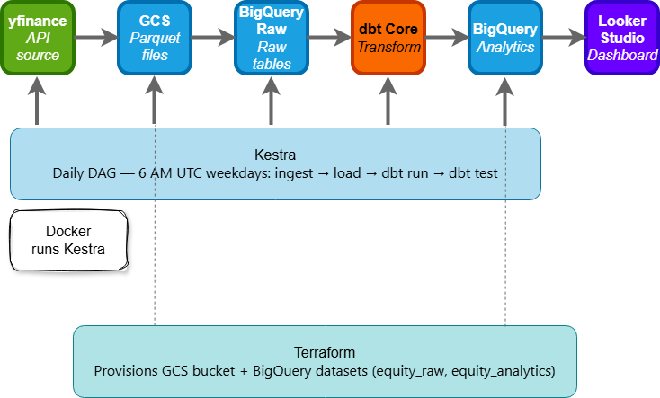
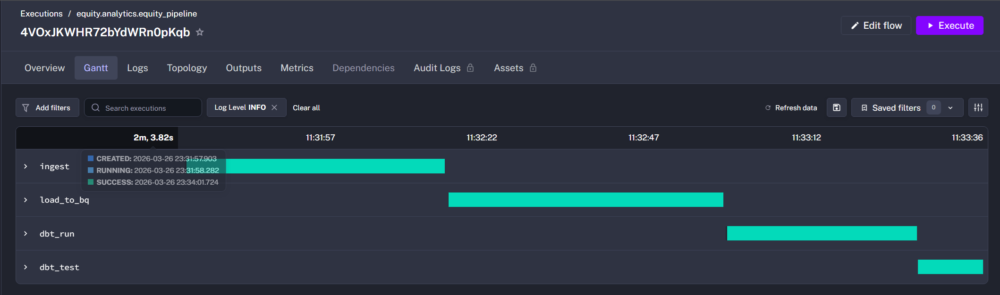
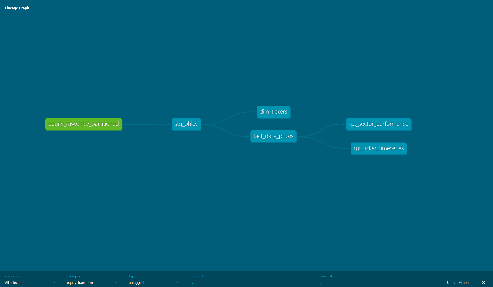
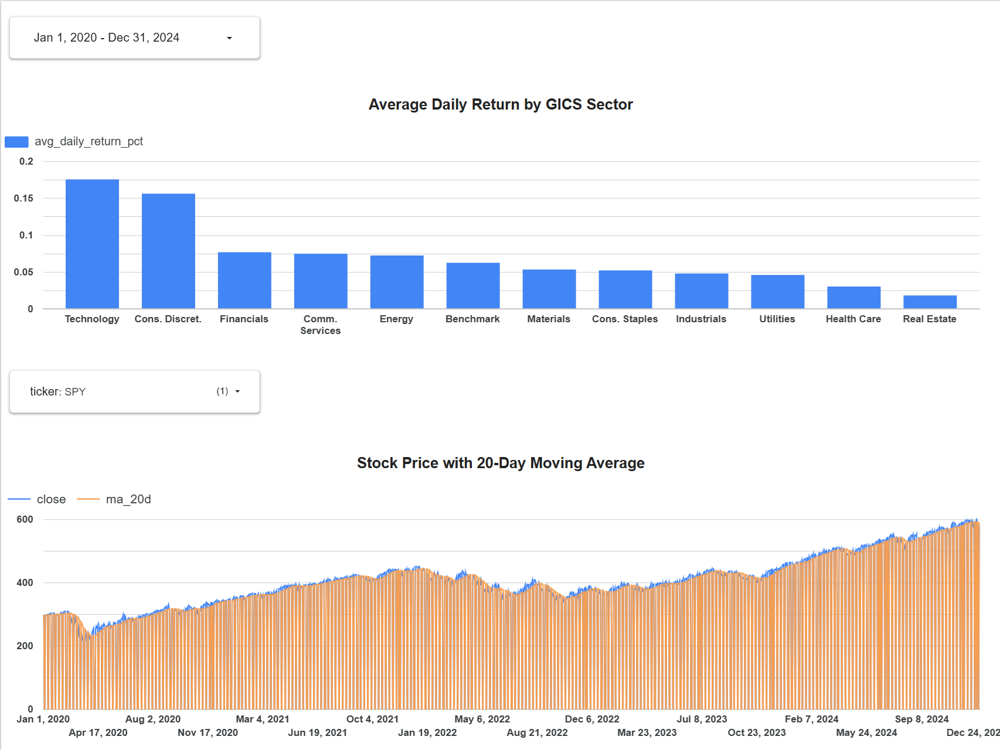

# US Equity Analytics Pipeline


## Problem Statement


Institutional asset managers running Separately Managed Account (SMA) strategies
require clean, timely, structured equity data to execute daily portfolio
rebalancing, performance attribution, and tax-loss harvesting. Without a
reliable data platform, these workflows depend on manual data pulls, ad-hoc
scripts, and brittle spreadsheets that introduce errors and delay.


This project builds an end-to-end batch data pipeline that mirrors the data
platform pattern used by SMA strategies at firms like BlackRock. It ingests
daily OHLCV (Open, High, Low, Close, Volume) price data for 33 US equities
across all 11 GICS sectors plus the S&P 500 ETF as a benchmark, transforming
raw market data into analysis-ready tables with pre-computed analytics metrics.


The pipeline answers two core questions that drive equity portfolio analysis:
which sectors have generated the strongest risk-adjusted returns over a given
period, and how has a specific stock's price trended relative to its moving
average? These questions underpin sector rotation strategies, momentum signals,
and mean-reversion analyses that are central to quantitative equity management.


By automating ingestion, transformation, and visualization on a daily weekday
schedule, this project demonstrates the data engineering foundation that makes
systematic equity analysis reproducible, auditable, and scalable — the same
properties required in regulated financial environments.


## Overview


This pipeline ingests daily OHLCV equity data for 33 US stocks across all 11
GICS sectors and the SPY benchmark via yfinance, stores raw Parquet files in
Google Cloud Storage, loads them into BigQuery as a partitioned and clustered
table, and transforms the data through a three-layer dbt project into
analysis-ready tables with daily returns and moving averages. The entire
pipeline runs automatically on a daily weekday schedule via a Kestra DAG
running in Docker.


The Looker Studio dashboard surfaces two views of the data: a sector
performance bar chart showing average daily return by GICS sector across a
selected date range, and a stock price time series with 20-day moving average
for any selected ticker. Both tiles are fed directly by dbt reporting views,
ensuring the dashboard always reflects the latest pipeline run.


All infrastructure is provisioned via Terraform (GCS bucket + BigQuery
datasets), making the full cloud environment reproducible from a single
terraform apply command. A Makefile at the project root provides shortcut
commands for all pipeline operations, including make pipeline to run the
full ingest → load → transform → test sequence.


## Table of Contents


- [Problem Statement](#problem-statement)
- [Overview](#overview)
- [Tech Stack](#tech-stack)
- [Architecture](#architecture)
- [Project Structure](#project-structure)
- [Data Source](#data-source)
- [Data Pipeline](#data-pipeline)
- [BigQuery: Partitioning & Clustering](#bigquery-partitioning--clustering)
- [dbt Models](#dbt-models)
- [Dashboard](#dashboard)
- [Data Quality & Testing](#data-quality--testing)
- [Steps to Reproduce](#steps-to-reproduce)
- [Acknowledgements](#acknowledgements)


## Tech Stack


| Component              | Technology           | Purpose |
|------------------------|----------------------|---------|
| Infrastructure as Code | Terraform            | Provisions the GCS data lake bucket and BigQuery datasets reproducibly. Any reviewer can recreate the full cloud infrastructure with three commands (`terraform init`, `terraform plan`, `terraform apply`). |
| Cloud Platform         | GCP                  | Hosts all infrastructure — object storage (GCS), analytical database (BigQuery), and authentication (IAM service accounts). |
| Data Lake              | Google Cloud Storage | Stores raw OHLCV data as Parquet files partitioned by ticker. Decouples ingestion from the warehouse — raw data survives independently of BigQuery. |
| Data Warehouse         | BigQuery             | Stores and queries structured equity data. Tables are partitioned by date and clustered by ticker and sector for query efficiency. |
| Transformation         | dbt Core             | Transforms raw BigQuery data through staging → marts → reporting layers. Applies moving averages, daily returns, and sector aggregations. Version-controlled SQL with built-in data quality tests. |
| Data Ingestion         | Python + yfinance    | Downloads daily OHLCV data for 33 US equities and SPY from Yahoo Finance. No API key required. |
| Environment Management | uv                   | Manages Python virtual environments and dependency locking. Ensures reproducible installs across local and containerized environments. |
| Version Control        | Git + GitHub         | Tracks all code changes. Required for zoomcamp project submission and peer review. |
| Orchestration          | Kestra               | Runs the 4-task pipeline DAG on a daily weekday schedule. Handles task dependencies, retries, and execution logging. |
| Containerization       | Docker               | Runs Kestra and its backing Postgres database in isolated containers. Ensures the orchestration layer is reproducible across machines. |
| Visualization          | Looker Studio        | Free BI tool with native BigQuery integration. Serves a two-tile dashboard — sector performance bar chart and stock price time series — directly from dbt reporting views. |


## Architecture





**Data flow:** yfinance API → GCS (Parquet files) → BigQuery raw table →
dbt transformations → BigQuery analytics tables → Looker Studio dashboard


**Orchestration:** Kestra DAG runs all stages daily at 6 AM UTC on weekdays


**Infrastructure:** Terraform provisions the GCS bucket and BigQuery datasets


## Project Structure


```
equity-analytics-pipeline/
├── .env.example                          # Template for required environment variables
├── .gitignore                            # Excludes credentials, state files, generated artifacts
├── .python-version                       # Python version pin for uv
├── Makefile                              # Shortcut commands: make pipeline, make up, make help
├── README.md                             # This file
├── docker-compose.yml                    # Runs Kestra + Postgres in Docker
├── pyproject.toml                        # Python dependencies managed by uv
├── uv.lock                               # Locked dependency versions for reproducibility
├── dbt/
│   └── equity_transforms/               # dbt project root
│       ├── dbt_project.yml              # dbt project configuration and layer materializations
│       ├── packages.yml                 # dbt-utils dependency declaration
│       ├── profiles.yml                 # BigQuery connection config (uses env_var for credentials)
│       └── models/
│           ├── schema.yml               # Model documentation, data tests, source declarations
│           ├── staging/
│           │   └── stg_ohlcv.sql        # Cleans raw data, casts types, adds daily_return_pct
│           ├── marts/
│           │   ├── dim_tickers.sql      # Dimension table — distinct ticker/sector combinations
│           │   └── fact_daily_prices.sql # Fact table — prices, returns, 20d/50d moving averages
│           └── reporting/
│               ├── rpt_sector_performance.sql  # Sector-level aggregations — feeds Dashboard Tile 1
│               └── rpt_ticker_timeseries.sql   # Per-ticker price + MA — feeds Dashboard Tile 2
├── images/
│   ├── architecture_diagram.drawio      # Editable source for architecture diagram
│   ├── architecture_diagram.png         # Architecture diagram embedded in README
│   ├── dashboard.png                    # Looker Studio dashboard screenshot
│   ├── dbt_lineage.png                  # dbt model lineage graph
│   ├── kestra_dag.png                   # Kestra pipeline execution screenshot
│   └── terraform_apply.png             # Terraform apply output screenshot
├── ingestion/
│   ├── ingest.py                        # Downloads OHLCV from yfinance, uploads to GCS as Parquet
│   ├── load_to_bq.py                    # Loads GCS Parquet into BigQuery, creates partitioned table
│   └── requirements.txt                # Ingestion-specific dependencies
├── kestra/
│   └── flows/
│       └── equity_pipeline.yml          # Kestra DAG: ingest → load → dbt run → dbt test
└── terraform/
    ├── main.tf                          # GCS bucket + BigQuery dataset resource definitions
    └── variables.tf                     # Project ID and region input variables
```


## Data Source


**Library:** [yfinance](https://ranaroussi.github.io/yfinance/) — free, no API key required
**Date range:** 2020-01-01 to 2024-12-31 (configurable via `.env`)
**Universe:** 33 US equities (3 per GICS sector across all 11 sectors) + SPY benchmark
**Fields:** date, open, high, low, close, volume, ticker, sector
**Format:** Parquet — columnar, compressed, type-preserving
**Lake path:** gs://equity-analytics-pipeline-equity-lake/raw/equities/ticker={TICKER}/data.parquet


## Data Pipeline


### Ingestion


Daily OHLCV data for 33 US equities and SPY is downloaded from Yahoo Finance
via yfinance and uploaded to GCS as Parquet files. One file per ticker, stored
at `raw/equities/ticker={TICKER}/data.parquet` using Hive-style partitioning.


### Data Lake


Raw Parquet files land in the GCS bucket
`equity-analytics-pipeline-equity-lake`. This decouples ingestion from the
warehouse — raw data is preserved independently of BigQuery and can be
reloaded without re-fetching from yfinance.


### Data Warehouse


Parquet files are loaded from GCS into BigQuery as `equity_raw.ohlcv_raw`,
then a partitioned and clustered version is created as
`equity_raw.ohlcv_partitioned`. See BigQuery: Partitioning & Clustering below.


### Transformation


dbt Core transforms raw data through three layers. See dbt Models below.


### Orchestration


The pipeline is orchestrated by [Kestra](https://kestra.io/) running in Docker.
A single flow (`kestra/flows/equity_pipeline.yml`) defines a 4-task DAG that
runs automatically at 6 AM UTC every weekday:


1. **ingest** — downloads OHLCV data from yfinance, uploads Parquet files to GCS
2. **load_to_bq** — loads Parquet files from GCS into BigQuery raw tables
3. **dbt_run** — executes all dbt models (staging → marts → reporting)
4. **dbt_test** — runs data quality tests on all transformed tables


Tasks execute sequentially — each must complete successfully before the next
starts. If any task fails, Kestra halts execution and downstream tasks do not
run on bad data.


Each task runs in an isolated Docker container (`python:3.12-slim` for ingestion,
`ghcr.io/dbt-labs/dbt-bigquery:1.8.0` for transformation) with dependencies
installed fresh per execution.





### Visualization


Looker Studio connects directly to BigQuery and queries the reporting
layer views (`rpt_sector_performance`, `rpt_ticker_timeseries`) on demand.
No data export or intermediate step is required. The dashboard updates
automatically after each daily Kestra pipeline run.


## BigQuery: Partitioning & Clustering


The raw BigQuery table (`equity_raw.ohlcv_partitioned`) is:
- **Partitioned by:** `date` — daily partitions (DATE column, no wrapper needed)
- **Clustered by:** `ticker`, then `sector`


**Why partition by date?**
Every query in this pipeline — in dbt models and in the dashboard — filters by
date range. BigQuery uses the partition boundary to skip entire days it doesn't
need to scan. A query for the last 30 days reads ~30 partitions instead of
the full table, reducing bytes scanned and query cost proportionally.


**Why cluster by ticker and sector?**
The dashboard and dbt models almost always GROUP BY or filter on ticker and sector.
Clustering physically co-locates rows with the same ticker value in storage,
so BigQuery reads a contiguous block of data for a given ticker rather than
scanning the entire partition. For a 33-ticker dataset this reduces bytes
scanned per query by approximately 1/33 when filtering on a single ticker.


The dbt fact table (`equity_analytics.fact_daily_prices`) uses the same
partitioning and clustering strategy, applied via dbt's `config()` macro.


## dbt Models


Transformations use dbt Core with the BigQuery adapter across three layers:


**Staging** (`equity_analytics.stg_ohlcv`) — view
Reads from `equity_raw.ohlcv_partitioned`. Casts types, filters invalid
prices, and computes `daily_return_pct` using a LAG window function.


**Marts**
- `dim_tickers` (table) — distinct ticker/sector combinations
- `fact_daily_prices` (table) — prices, daily returns, 20-day and 50-day
  moving averages. Partitioned by date, clustered by ticker and sector.


**Reporting**
- `rpt_sector_performance` (view) — sector-level daily return aggregations,
  feeds Dashboard Tile 1
- `rpt_ticker_timeseries` (view) — price and moving average per ticker,
  feeds Dashboard Tile 2





## Dashboard


Two-tile Looker Studio dashboard connected directly to BigQuery:


**Tile 1 — Average Daily Return by GICS Sector**
Bar chart showing average daily return percentage per sector across the
selected date range. Allows comparison of sector performance relative to
the S&P 500 benchmark (SPY).


**Tile 2 — Stock Price with 20-Day Moving Average**
Time series showing daily close price and 20-day moving average for a
selected ticker. Moving average is pre-computed by dbt in
`fact_daily_prices` and served via `rpt_ticker_timeseries`.





[View live dashboard](https://lookerstudio.google.com/reporting/1520a3de-3182-4253-9643-2a2fe92b8a08)


## Data Quality & Testing


dbt generic tests run as Task 4 in the Kestra DAG after every dbt run:


| Test | Model | Guards against |
|------|-------|----------------|
| `not_null` on date, ticker | `stg_ohlcv`, `fact_daily_prices` | Missing primary keys |
| `unique` on ticker | `dim_tickers` | Duplicate dimension entries |
| `unique_combination_of_columns` (date+ticker) | `fact_daily_prices` | Duplicate fact rows |
| `accepted_values` on sector | source `ohlcv_partitioned` | Invalid sector names from ingestion |


If any test fails, Kestra halts and the dashboard is not updated with bad data.


## Steps to Reproduce


A Makefile at the project root provides shortcut commands for all operations.
Run `make help` to see all available commands after completing setup.


**Prerequisites:**
- WSL2 (Ubuntu-22.04) with uv, Git, gcloud CLI, Terraform, and Docker Desktop installed
- A GCP account with billing enabled
- Copy `.env.example` to `.env` and fill in your values
- Create the project symlink (required for Makefile):
```bash
  sudo ln -s "$(pwd)" /opt/equity-pipeline
```
  Run this from inside the cloned repository directory after step 1.
```


1. **Clone the repository**
   ```bash
   git clone https://github.com/reuvenlevy1/equity-analytics-pipeline.git
   cd equity-analytics-pipeline
   ```


2. **Install dependencies**
   ```bash
   make setup
   ```


3. **GCP setup** — create a service account, download credentials JSON,
   save as `gcp-credentials.json` in the project root (see Phase 0 notes)


4. **Provision infrastructure**
   ```bash
   make infra
   ```


5. **Configure environment** — copy `.env.example` to `.env` and fill in values


6. **Run the full pipeline**
   ```bash
   make pipeline
   ```


7. **Start Kestra** (for scheduled execution)
   ```bash
   make up
   make deploy-flow
   ```
   Then open http://localhost:8080 and trigger a manual execution to verify.


8. **View the dashboard**
   Open the live Looker Studio report: [Dashboard link](https://lookerstudio.google.com/reporting/1520a3de-3182-4253-9643-2a2fe92b8a08)


## Acknowledgements


- [DataTalks.Club](https://datatalks.club/) — Data Engineering Zoomcamp curriculum and community
- [yfinance](https://ranaroussi.github.io/yfinance/) / Yahoo Finance — free equity market data
- [dbt Labs](https://www.getdbt.com/) — dbt Core and dbt-utils package
- [Kestra](https://kestra.io/) — open-source workflow orchestration platform
